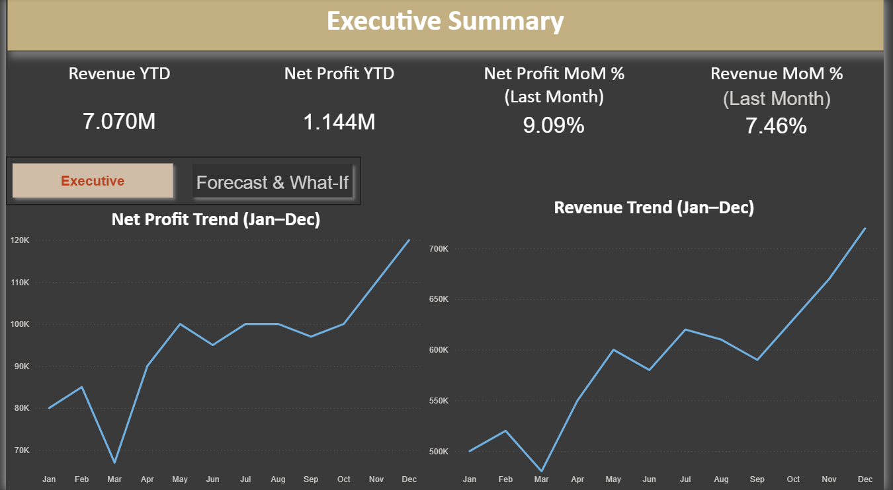
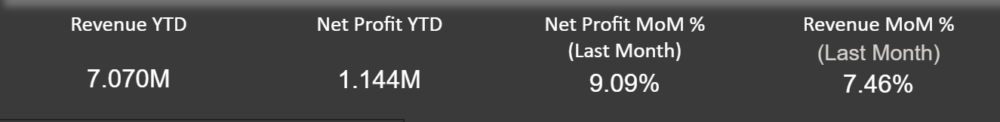
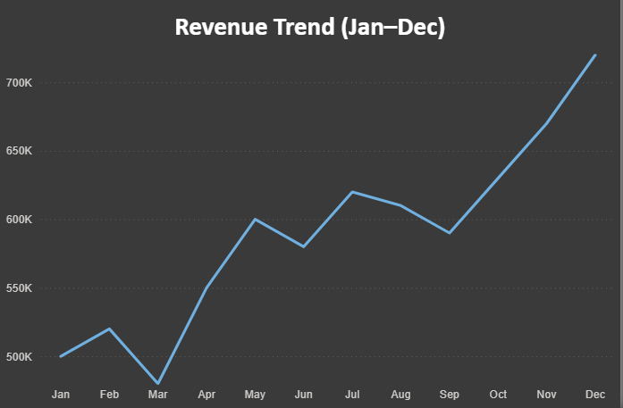
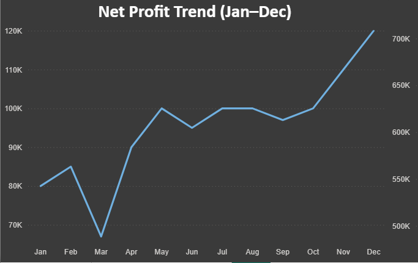
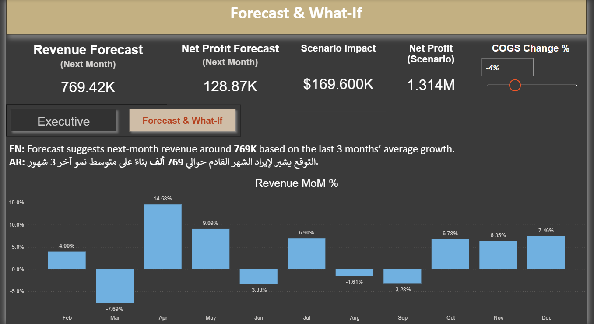
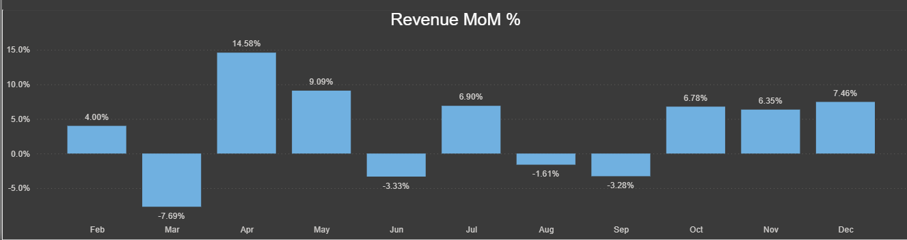
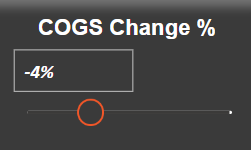

### \# 📊 Executive Financial Dashboard – Forecast \& What-If

### \# 📊 داشبورد مالي تنفيذي – التوقع وتحليل السيناريوهات

### 

### ---

### 

### \## 🧾 Project Overview | نظرة عامة على المشروع

### 

### 

### This project presents an executive-level financial dashboard built in Power BI to monitor company performance, analyze trends, forecast next-month revenue and profit, and simulate cost-impact scenarios using dynamic What-If parameters.

### 

### The dashboard focuses on:

### \- Year-to-Date performance (YTD)

### \- Month-over-Month growth (MoM %)

### \- Revenue \& Net Profit trends

### \- Forecasting using last 3 months’ average growth

### \- Profitability simulation via cost adjustment

### 

### ---

### 

### 

### هذا المشروع عبارة عن داشبورد مالي تنفيذي تم بناؤه باستخدام Power BI بهدف:

### 

### \- متابعة الأداء المالي السنوي (YTD)

### \- تحليل معدل النمو الشهري (MoM %)

### \- عرض اتجاهات الإيرادات وصافي الربح

### \- التنبؤ بإيراد وربح الشهر القادم

### \- محاكاة تأثير تغيير تكلفة المبيعات (COGS) على صافي الربح باستخدام What-If Parameter

### 

### ---

### 

### \# 🛠 Tools \& Technologies | الأدوات المستخدمة

### 

### \- Excel (مصدر البيانات)

### \- Power BI (التصميم والتحليل)

### \- DAX (المعادلات والتحليل المتقدم)

### 

### ---

### 

### \# 📄 Page 1 – Executive Summary

### \# 📄 الصفحة الأولى – الملخص التنفيذي

### 

### 

### This page provides a high-level financial overview including:

### 

### \- Revenue YTD

### \- Net Profit YTD

### \- Revenue MoM % (Last Month)

### \- Net Profit MoM % (Last Month)

### \- Monthly Revenue Trend

### \- Monthly Net Profit Trend

### 

### ---

### 

### 

### تعرض هذه الصفحة نظرة عامة تنفيذية على الأداء المالي وتشمل:

### 

### \- إجمالي الإيرادات منذ بداية السنة (YTD)

### \- صافي الربح منذ بداية السنة

### \- نسبة نمو الإيرادات للشهر الأخير

### \- نسبة نمو صافي الربح للشهر الأخير

### \- رسم بياني لاتجاه الإيرادات

### \- رسم بياني لاتجاه صافي الربح

### 

### ---

### 

### \## 📷 Screenshots

### 

### \### Executive Summary


### 

### \### KPI Close View

 

### 

### \### Revenue Trend

 

### 

### \### Net Profit Trend

 

### 

### ---

### 

### \# 🔮 Page 2 – Forecast \& What-If

### \# 🔮 الصفحة الثانية – التوقع وتحليل السيناريو

### 

### ---

### 

### \## 📈 Forecast Logic | منطق التوقع

### 

### 

### The forecast is calculated using the average Month-over-Month growth of the last 3 months.

### 

### This provides a simple, explainable forecasting baseline suitable for executive reporting.

### 

### ---

### 

### 

### تم حساب التوقع بناءً على متوسط معدل النمو الشهري لآخر 3 شهور.

### 

### هذا النموذج بسيط لكنه مناسب للتقارير التنفيذية ويعطي تصور مبدئي للأداء المتوقع.

### 

### ---

### 

### \## 🎛 What-If Scenario | تحليل السيناريو

### 

### 

### A dynamic What-If parameter allows simulation of COGS percentage change and recalculates:

### 

### \- Net Profit (Scenario)

### \- Scenario Impact

### 

### ---

### 

### تم إنشاء شريط تحكم (Slider) يسمح بتغيير نسبة تكلفة المبيعات (COGS Change %)  

### ويتم إعادة حساب:

### 

### \- صافي الربح بعد التغيير

### \- الفرق بين الربح الفعلي وربح السيناريو

### 

### ---

### 

### \## 📷 Forecast \& Scenario Screens

### 

### \### Forecast Page

 

### 

### \### Forecast Explanation


### 

### \### Revenue MoM Chart

 

### 

### \### What-If Slider

 

### 

### \### Page Navigator


### 

### ---

### 

### \# 🧮 Core DAX Measures | أهم معادلات DAX

### 

### ```DAX

### -- =========================

### -- Base Measures

### -- =========================

### Revenue Amount =

### SUM(Finance\_Model\[Revenue])

### 

### Net Profit Amount =

### SUM(Finance\_Model\[Net Profit])

### 

### COGS Amount =

### SUM(Finance\_Model\[COGS])

### 

### OpEx Amount =

### SUM(Finance\_Model\[Operating Expenses])

### 

### -- =========================

### -- MoM % Measures

### -- =========================

### Revenue MoM % =

### VAR m = MAX(Finance\_Model\[Month Order])

### VAR Curr = \[Revenue Amount]

### VAR Prev =

### &nbsp;   CALCULATE(

### &nbsp;       \[Revenue Amount],

### &nbsp;       FILTER(

### &nbsp;           ALL(Finance\_Model\[Month Order]),

### &nbsp;           Finance\_Model\[Month Order] = m - 1

### &nbsp;       )

### &nbsp;   )

### RETURN

### IF(m = 1, BLANK(), DIVIDE(Curr - Prev, Prev))

### 

### Net Profit MoM % =

### VAR m = MAX(Finance\_Model\[Month Order])

### VAR Curr = \[Net Profit Amount]

### VAR Prev =

### &nbsp;   CALCULATE(

### &nbsp;       \[Net Profit Amount],

### &nbsp;       FILTER(

### &nbsp;           ALL(Finance\_Model\[Month Order]),

### &nbsp;           Finance\_Model\[Month Order] = m - 1

### &nbsp;       )

### &nbsp;   )

### RETURN

### IF(m = 1, BLANK(), DIVIDE(Curr - Prev, Prev))

### 

### -- =========================

### -- MoM % (Last Month)

### -- =========================

### Revenue MoM % (Last Month) =

### VAR LastM =

### &nbsp;   MAXX(ALL(Finance\_Model\[Month Order]), Finance\_Model\[Month Order])

### RETURN

### CALCULATE(\[Revenue MoM %], Finance\_Model\[Month Order] = LastM)

### 

### Net Profit MoM % (Last Month) =

### VAR LastM =

### &nbsp;   MAXX(ALL(Finance\_Model\[Month Order]), Finance\_Model\[Month Order])

### RETURN

### CALCULATE(\[Net Profit MoM %], Finance\_Model\[Month Order] = LastM)

### 

### -- =========================

### -- Forecast Measures

### -- =========================

### Revenue Forecast (Next Month) =

### VAR LastM =

### &nbsp;   MAXX(ALL(Finance\_Model\[Month Order]), Finance\_Model\[Month Order])

### VAR LastRev =

### &nbsp;   CALCULATE(\[Revenue Amount], Finance\_Model\[Month Order] = LastM)

### VAR AvgGrowth =

### &nbsp;   AVERAGEX(

### &nbsp;       FILTER(

### &nbsp;           ALL(Finance\_Model\[Month Order]),

### &nbsp;           Finance\_Model\[Month Order] >= LastM - 2

### &nbsp;               \&\& Finance\_Model\[Month Order] <= LastM

### &nbsp;       ),

### &nbsp;       \[Revenue MoM %]

### &nbsp;   )

### RETURN

### LastRev \* (1 + AvgGrowth)

### 

### Net Profit Forecast (Next Month) =

### VAR LastM =

### &nbsp;   MAXX(ALL(Finance\_Model\[Month Order]), Finance\_Model\[Month Order])

### VAR LastNP =

### &nbsp;   CALCULATE(\[Net Profit Amount], Finance\_Model\[Month Order] = LastM)

### VAR AvgGrowth =

### &nbsp;   AVERAGEX(

### &nbsp;       FILTER(

### &nbsp;           ALL(Finance\_Model\[Month Order]),

### &nbsp;           Finance\_Model\[Month Order] >= LastM - 2

### &nbsp;               \&\& Finance\_Model\[Month Order] <= LastM

### &nbsp;       ),

### &nbsp;       \[Net Profit MoM %]

### &nbsp;   )

### RETURN

### LastNP \* (1 + AvgGrowth)

### 

### -- =========================

### -- What-If Scenario

### -- =========================

### Net Profit (Scenario) =

### VAR Change = SELECTEDVALUE('COGS Change %'\[COGS Change % Value], 0)

### VAR Revenue = \[Revenue Amount]

### VAR COGS = \[COGS Amount]

### VAR OpEx = \[OpEx Amount]

### VAR NewCOGS = COGS \* (1 + Change)

### RETURN

### Revenue - NewCOGS - OpEx

### 

### Scenario Impact =

### \[Net Profit (Scenario)] - \[Net Profit Amount]

### ```

### 

### ---

### 

### \# ⚠️ Limitations | القيود

### 

### 

### \- Sample dataset for demonstration

### \- Simplified forecast model (3-month average growth)

### \- No Date Table implemented

### \- Excel-based static data source

### 

### \- البيانات تجريبية وليست حقيقية

### \- نموذج التوقع مبسط

### \- لا يوجد جدول تواريخ احترافي

### \- مصدر البيانات Excel وليس قاعدة بيانات مباشرة

### 

### ---

### 

### \# 🚀 Future Improvements | التطوير المستقبلي

### 

### \- Add full Date Table + Time Intelligence

### \- Connect to SQL Server

### \- Apply advanced forecasting techniques

### \- Implement Row-Level Security (RLS)

### \- Redesign using Star Schema model

### 

### \- إضافة جدول تواريخ احترافي وتحليل زمني متكامل

### \- ربط المشروع بقاعدة بيانات SQL Server

### \- تطوير نموذج التوقع ليشمل موسمية

### \- تطبيق نظام صلاحيات المستخدمين

### \- إعادة تصميم النموذج بهيكل Star Schema


